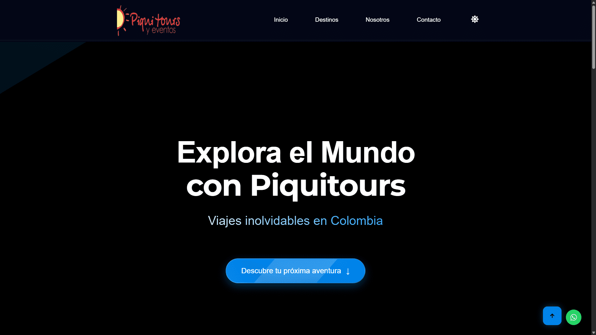

# Piquitours y Eventos



Este proyecto está diseñado para gestionar y organizar tours y eventos de manera eficiente de la empresa Piquitours y eventos.

## Descripción

Piquitours y Eventos es una plataforma que permite a los usuarios explorar, reservar y gestionar tours y eventos. Ofrece una interfaz amigable y funcionalidades avanzadas para facilitar la experiencia del usuario.

## Características

- Exploración de tours y eventos
- Reservas en línea
- Gestión de usuarios
- Notificaciones y recordatorios
- Integración con pasarelas de pago

## Instalación

1. Clona el repositorio:

   ```bash
   git clone https://github.com/rx3card/piquitours
   ```

2. Navega al directorio del proyecto:

   ```bash
   cd piquitours
   ```

3. Instala las dependencias:

   Si tienes `pnpm` instalado:

   ```bash
   pnpm install
   ```

   Si no tienes `pnpm`, instálalo con el siguiente comando:

   ```bash
   npm install -g pnpm
   ```

   O usa `npm` directamente:

   ```bash
   npm install
   ```

4. Configura las variables de entorno en un archivo `.env`:

   ```env
   DB_HOST=tu_host_de_base_de_datos
   DB_USER=tu_usuario_de_base_de_datos
   DB_PASS=tu_contraseña_de_base_de_datos
   ```

5. Inicia el servidor:

   Si usas `pnpm`:

   ```bash
   pnpm run dev
   ```

   O con `npm`:

   ```bash
   npm run dev
   ```

## Uso

Accede a la aplicación en `http://localhost:5173` para explorar tours, realizar reservas y gestionar tu cuenta.

## Tecnologías Utilizadas

<p align="center">
  
  
  
  
  
  <!--  -->
  <!--  -->
  <!--  -->
  <!--  -->
  <!--  -->
  <!--  -->
  <!--  -->
  
  
</p>

## Licencia

Este proyecto está licenciado bajo la Licencia MIT. Consulta el archivo `LICENSE` para más detalles.

---

<a href='https://github.com/rx3card'>rx3card Oscar Rojas.</a>
